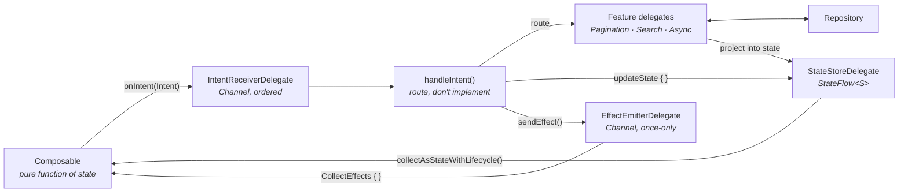

# MVI Blueprint — base + delegation

A small, complete, runnable reference for building Android screens with MVI, organised
around one idea:

> **The base class gives you the MVI loop and nothing else. Everything else is composed
> from delegates.**

Most MVI "base ViewModel" articles end with a base class that has grown a loading flag, a
paging cursor, a debounce helper and an error mapper — and every screen in the app
inherits all of it whether it needs it or not. This project shows the alternative:
capabilities are small, independently testable objects that a screen *acquires*, either
with Kotlin's `by` delegation or as a plain private field.

Nothing here is magic and nothing here is a framework you have to buy into. The whole core
is ~400 lines of ordinary Kotlin you are meant to read, disagree with, and adapt.

---

## The two kinds of delegation

This is the distinction the whole blueprint rests on. They are not the same thing and they
solve different problems.

### 1. Primitive capabilities — mixed into the base with `by`

An MVI ViewModel needs exactly three things: somewhere to keep state, somewhere to send
one-shot effects, and somewhere to receive intents. Each is an interface with one
implementation, and `MviViewModel` acquires all three by delegation instead of
implementing them:

```kotlin
abstract class MviViewModel<I : MviIntent, S : MviState, E : MviEffect>(
    initialState: S,
) : ViewModel(),
    StateStore<S>     by StateStoreDelegate(initialState),
    EffectEmitter<E>  by EffectEmitterDelegate(),
    IntentReceiver<I> by IntentReceiverDelegate() {

    init {
        viewModelScope.launch { intents.collect { handleIntent(it) } }
    }

    protected abstract suspend fun handleIntent(intent: I)
}
```

That `init` block is the only logic in the base class. Every screen inherits the loop and
nothing more.

**Why not just put three `MutableStateFlow`s in the base class?** Because then they are
welded in. As delegates: each one is unit-testable without constructing a ViewModel, each
one is swappable (a `SavedStateStoreDelegate` that survives process death drops in with no
change to the base), and the base class has no room to grow.

### 2. Feature capabilities — composed as private fields

Pagination, debounced search, one-shot loading: real behaviour that *some* screens need.
These are **not** in the base class. A screen that needs pagination declares it:

```kotlin
private val paging = PaginationDelegate(viewModelScope, pageSize = 20) { page, size ->
    repository.users(search.query.value, page, size)
}
```

The delegate owns its own little state machine and knows nothing about the screen. The
ViewModel *projects* that state into its own flat `MviState`, which is why the UI never
learns that a delegate exists.

---

## The loop



One direction, no cycles you can't see. The UI reports *facts* (`LoadNextPage` — "the user
scrolled near the bottom"), never decisions ("fetch page 3").

---

## Modules

```
:mvi-core          The blueprint. No DI, no networking, no app code. Depend on this.
  core/            MviIntent · MviState · MviEffect · MviViewModel · Async
  core/state/      StateStore + StateStoreDelegate
  core/effect/     EffectEmitter + EffectEmitterDelegate
  core/intent/     IntentReceiver + IntentReceiverDelegate
  core/delegate/   PaginationDelegate · SearchQueryDelegate · AsyncDelegate
  core/compose/    CollectEffects

:app               A sample that consumes it.
  data/            UserRepository interface + an in-memory fake
  di/              A 3-line ServiceLocator (swap for Hilt/Koin without touching :mvi-core)
  feature/userlist/    Paged + searchable list — PaginationDelegate + SearchQueryDelegate
  feature/userdetail/  Single load — AsyncDelegate
  navigation/      NavHost; features emit effects, they never hold a NavController
```

---

## Adding a screen — the four steps

Every screen in this project is the same four steps. Copy `feature/userdetail` and edit.

**1. Write the contract.** One file, three declarations, and now the whole screen is
knowable by reading it.

```kotlin
sealed interface CartIntent : MviIntent {
    data object CheckoutClicked : CartIntent
    data class QuantityChanged(val itemId: String, val quantity: Int) : CartIntent
}

data class CartState(
    val items: List<CartRow> = emptyList(),
    val isLoading: Boolean = false,
) : MviState

sealed interface CartEffect : MviEffect {
    data object OpenCheckout : CartEffect
}
```

**2. Compose, project, route.** The ViewModel body is always these three parts in this
order.

```kotlin
class CartViewModel(repository: CartRepository)
    : MviViewModel<CartIntent, CartState, CartEffect>(CartState()) {

    // Compose
    private val cart = AsyncDelegate(viewModelScope) { repository.cart() }

    // Project
    init {
        cart.state
            .onEach { async -> updateState { copy(items = async.valueOrNull.orEmpty(), isLoading = async.isLoading) } }
            .launchIn(viewModelScope)
        cart.load()
    }

    // Route
    override suspend fun handleIntent(intent: CartIntent) = when (intent) {
        CartIntent.CheckoutClicked -> sendEffect(CartEffect.OpenCheckout)
        is CartIntent.QuantityChanged -> updateState { /* ... */ }
    }
}
```

**3. Split the UI in two.** A stateful `Route` that owns the ViewModel and handles
effects, and a stateless `Screen` that is a pure function of state. The second half is
what you can `@Preview` and screenshot-test.

```kotlin
@Composable
fun CartRoute(onCheckout: () -> Unit, viewModel: CartViewModel = viewModel(factory = ...)) {
    val state by viewModel.state.collectAsStateWithLifecycle()
    CollectEffects(viewModel.effect) { effect ->
        when (effect) { CartEffect.OpenCheckout -> onCheckout() }
    }
    CartScreen(state = state, onIntent = viewModel::onIntent)
}
```

**4. Test through the contract.** No Robolectric, no mocking framework, no `Thread.sleep`.

```kotlin
@Test
fun `checkout opens the checkout screen`() = runTest {
    val viewModel = CartViewModel(FakeCartRepository())
    viewModel.effect.test {
        viewModel.onIntent(CartIntent.CheckoutClicked)
        advanceUntilIdle()
        assertEquals(CartEffect.OpenCheckout, awaitItem())
    }
}
```

---

## Adding a delegate

When two screens need the same non-trivial behaviour, that is the signal — **not** a
reason to add a method to `MviViewModel`. A delegate is any class that:

1. takes a `CoroutineScope` as a constructor parameter (never creates its own);
2. exposes a `StateFlow` of its own small state;
3. exposes plain functions to drive it;
4. knows nothing about any screen.

Rule 1 is what makes it testable with `runTest`'s scope and no `Dispatchers.setMain`.
Rule 4 is what makes it reusable — the moment a delegate imports a feature's `State`, it
has become that feature's code.

---

## The rules worth arguing about

**State or effect?** *If the screen rotated right now, should this happen again?* Yes →
state. No → effect. A snackbar is an effect. An error banner is state.

**Intents are named after what happened, not what to do.** `RetryClicked`, not
`ReloadUsers`. The UI reports; the ViewModel decides. This is what stops business logic
leaking into Composables.

**`handleIntent` must not block.** Intents are processed sequentially, in order, so a
branch that awaits the network stalls every later intent. Branches *start* work
(`paging.refresh()`) and return.

**`updateState { }` must be pure.** It can run more than once under concurrent updates.
Never send an effect or start work inside it.

**State is flat and render-ready.** `UserListState` exposes `isAppending: Boolean`, not
the `PagingState` it came from. The projection step in `init` is what buys you the freedom
to change delegates later without touching a Composable.

**Effects go through a `Channel`, never a `SharedFlow(replay = 1)`.** A replayed effect is
how "the app navigates twice after rotation" happens. `PrimitiveDelegatesTest` has the
test that pins this down.

---

## Running it

```bash
./gradlew :app:installDebug
```

The sample loads 137 fake users, 20 at a time, with a debounced search box. To see the
error and retry paths, **type `fail` into the search box** — failure is deterministic, not
random, so you can demo it on purpose.

Run the tests:

```bash
./gradlew test
```

39 unit tests, all JVM, no emulator: 26 for the core primitives and delegates, 8 for a
full screen, 5 for search debouncing.

---

## What is deliberately not here

- **A DI framework.** `ServiceLocator` is three lines. Swapping in Hilt or Koin changes
  the `Factory` in each ViewModel's companion object and nothing else.
- **Networking.** `FakeUserRepository` is in memory, so the project runs with no keys and
  no connection.
- **`SavedStateHandle` state restoration.** Left out to keep `StateStoreDelegate` at ten
  lines — and adding it is a new delegate, not a change to the base class, which is the
  point.
- **A `Reducer` abstraction.** A `when` in `handleIntent` is already exhaustive, already
  compiler-checked, and already readable. A pluggable reducer interface would add a layer
  and buy nothing here.

Each of those is a reasonable thing to add. If adding one requires editing `MviViewModel`,
the design has gone wrong.
