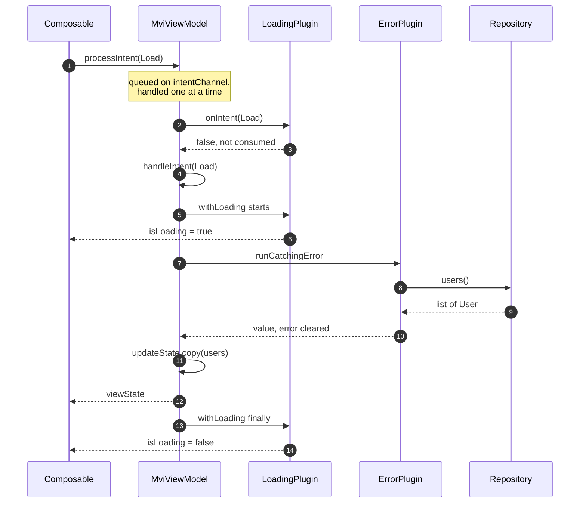
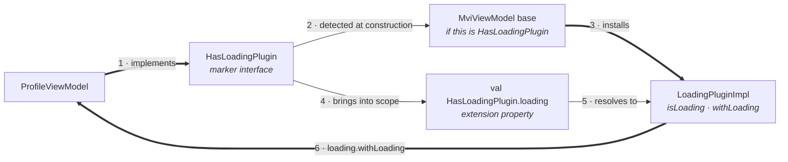
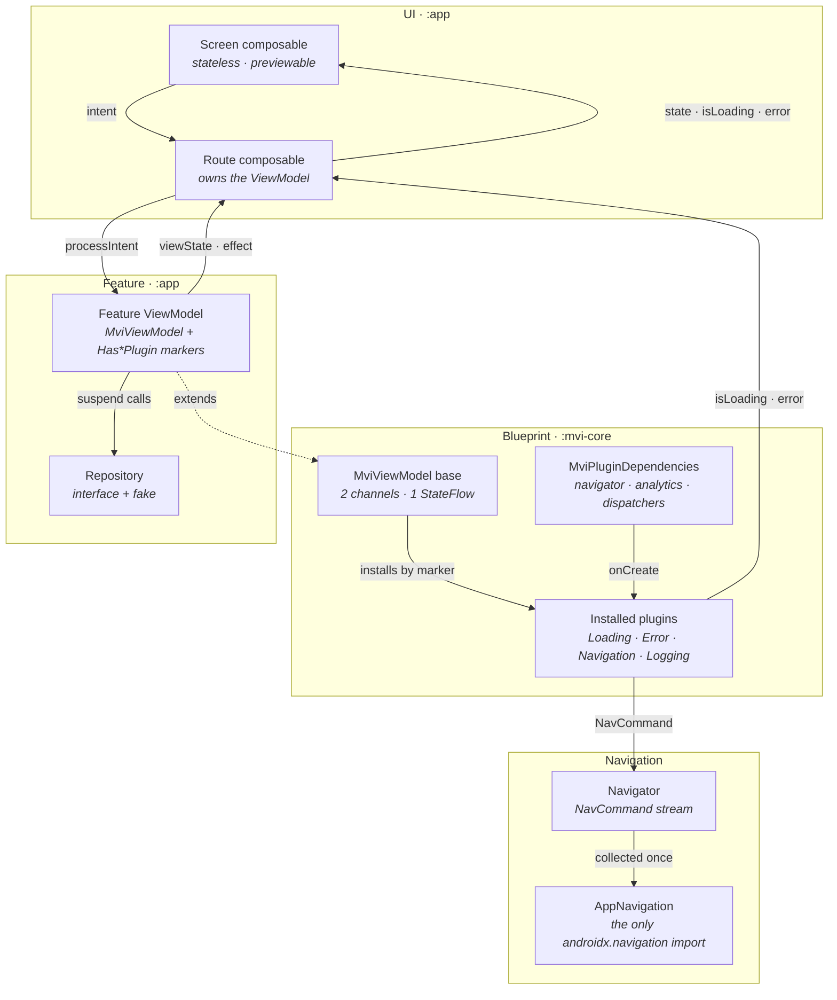
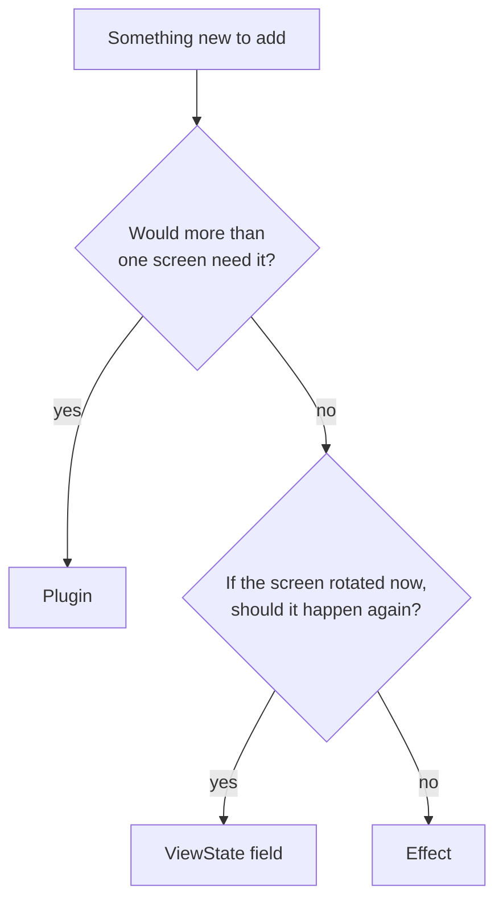

# MVI Blueprint

A small MVI base for Android Compose. One parent class owns the MVI loop; everything
cross-cutting — loading, errors, navigation, analytics — is a **plugin** a screen opts into
by implementing a marker interface.

You never write `isLoading` again, and a screen that didn't ask for loading can't even
name it.

```kotlin
class ProfileViewModel(
    private val repository: UserRepository,
    dispatcherProvider: DispatcherProvider,
    pluginDependencies: MviPluginDependencies,
) : MviViewModel<ProfileViewState, ProfileIntent, NoEffect>(dispatcherProvider, pluginDependencies),
    HasLoadingPlugin,      // <- gives you `loading`
    HasErrorPlugin {       // <- gives you `errors`

    override fun initialState() = ProfileViewState()

    override suspend fun handleIntent(intent: ProfileIntent) = when (intent) {
        ProfileIntent.Load -> loading.withLoading {
            val user = errors.runCatchingError { repository.user(id) } ?: return@withLoading
            updateState { copy(user = user) }
        }
    }
}
```

That's a complete screen: loading state, error handling, retry-ready, and no
`viewModelScope.launch` anywhere.

---

# Part 1 — How to use it

## Step 1. Add the module

```kotlin
dependencies {
    implementation(project(":mvi-core"))
}
```

## Step 2. Write the contract

One file per screen, three declarations. **Leave out `isLoading` and `errorMessage`** —
plugins own those.

```kotlin
sealed interface ProfileIntent : Intent {
    data object Load : ProfileIntent
    data object Retry : ProfileIntent
    data object BackClicked : ProfileIntent
}

data class ProfileViewState(val user: User? = null) : ViewState

sealed interface ProfileEffect : Effect {
    data class ShowMessage(val text: String) : ProfileEffect
}
```

No one-shot events at all? Use the shared `NoEffect` as your `Effect` type and skip the
third declaration.

## Step 3. Write the ViewModel

Extend `MviViewModel`, implement two functions, and list the plugins you want.

```kotlin
class ProfileViewModel(
    private val repository: UserRepository,
    dispatcherProvider: DispatcherProvider,
    pluginDependencies: MviPluginDependencies,
) : MviViewModel<ProfileViewState, ProfileIntent, ProfileEffect>(
    dispatcherProvider,
    pluginDependencies,
),
    HasLoadingPlugin,
    HasErrorPlugin,
    HasNavigationPlugin {

    override fun initialState() = ProfileViewState()

    override suspend fun handleIntent(intent: ProfileIntent) {
        when (intent) {
            ProfileIntent.Load, ProfileIntent.Retry -> load()
            ProfileIntent.BackClicked -> navigation.navigateBack()
        }
    }

    private suspend fun load() = loading.withLoading {
        val user = errors.runCatchingError { repository.user(id) } ?: return@withLoading
        updateState { copy(user = user) }
    }
}
```

`handleIntent` is `suspend`, and intents are handled one at a time in order — so call
suspending code directly. No `launch`.

## Step 4. Pick your plugins

Add the marker, get the accessor. That's the whole API.

| Add this marker | You get | Use it for |
| --- | --- | --- |
| `HasLoadingPlugin` | `loading` | `loading.withLoading { }`, `loading.isLoading` |
| `HasErrorPlugin` | `errors` | `errors.runCatchingError { }`, `errors.error` |
| `HasNavigationPlugin` | `navigation` | `navigation.navigateTo(dest)`, `navigateBack()` |
| `HasLoggingPlugin` | `logging` | `logging.logButtonEvent("id")` — call `configureLogging("screen_id")` in `init` first |

Leave a marker off and that accessor doesn't exist for your class. It's a compile error,
not a null.

## Step 5. Write the screen

Two composables. The **Route** owns the ViewModel; the **Screen** is a pure function you
can `@Preview`.

```kotlin
@Composable
fun ProfileRoute(viewModel: ProfileViewModel = viewModel(factory = ...)) {
    val state by viewModel.viewState.collectAsStateWithLifecycle()
    val isLoading by viewModel.loading.isLoading.collectAsStateWithLifecycle()
    val error by viewModel.errors.error.collectAsStateWithLifecycle()

    CollectEffects(viewModel.effect) { effect ->
        when (effect) {
            is ProfileEffect.ShowMessage -> snackbarHostState.showSnackbar(effect.text)
        }
    }

    LaunchedEffect(Unit) { viewModel.processIntent(ProfileIntent.Load) }

    ProfileScreen(state, isLoading, error, viewModel::processIntent)
}

@Composable
fun ProfileScreen(
    state: ProfileViewState,
    isLoading: Boolean,
    error: OperationError?,
    onIntent: (ProfileIntent) -> Unit,
) { /* ... onIntent(ProfileIntent.Retry) ... */ }
```

You collect **three** streams: your own `viewState`, plus `isLoading` and `error` from the
plugins. That's the visible cost of not putting them in `ViewState`.

## Step 6. Wire navigation once, for the whole app

Features never touch a `NavController`. One collector applies their commands:

```kotlin
CollectNavigation(ServiceLocator.navigator) { command ->
    when (command) {
        is NavCommand.To -> navController.navigate(command.destination.route)
        is NavCommand.Back -> navController.popBackStack()
        is NavCommand.PopUpTo -> navController.popBackStack(command.route, command.inclusive)
    }
}
```

## Step 7. Test it

Send intents. Assert screen data on `viewState`, and loading/errors on the plugins. No
Robolectric, no mocking library.

```kotlin
@Test
fun `a failure lands in the error plugin`() = runTest {
    val viewModel = ProfileViewModel(FailingRepository(), dispatchers, dependencies)

    viewModel.processIntent(ProfileIntent.Load)
    advanceUntilIdle()

    assertEquals("offline", viewModel.errors.error.value?.message)
    assertFalse(viewModel.loading.isLoading.value)
}
```

`MainDispatcherRule` is needed because `viewModelScope` runs on `Dispatchers.Main`.

**Working examples:** [UserListViewModel](app/src/main/java/com/example/mvi/feature/userlist/UserListViewModel.kt)
(all four plugins) and [UserDetailViewModel](app/src/main/java/com/example/mvi/feature/userdetail/UserDetailViewModel.kt)
(three — `logging` genuinely won't compile there).

---

# Part 2 — How it works

## Step 1. The UI sends an intent

`processIntent(intent)` drops it on a `Channel(UNLIMITED)` and returns immediately. It
never suspends and never drops anything, so it's safe from any callback or first
composition.

## Step 2. The channel serializes it

A single collector, started in the base class's `init`, drains the channel **one intent at
a time, in order**. This is why `handleIntent` can be `suspend`: while it awaits the
network, the next intent just waits its turn. No races, no `launch` in features.

## Step 3. Plugins get first look

```kotlin
val handled = plugins.map { it.onIntent(intent) }.any { it }
if (!handled) handleIntent(intent)
```

Every plugin sees every intent. Any plugin returning `true` **consumes** it, and your
`handleIntent` never runs. (Mapped before reduced deliberately — `any` short-circuits, so
otherwise a plugin's visibility would depend on its position in the list.)

## Step 4. `handleIntent` runs

Your `when` branch executes. It reduces state, emits effects, calls plugins, and awaits
the repository — all inline.

## Step 5. State goes out

`updateState { copy(...) }` reduces atomically via `getAndUpdate`, then broadcasts
`onStateChanged(old, new)` to every plugin. The UI collects `viewState`.

## Step 6. Effects go out

`emitEffect(e)` queues on a second `Channel` and broadcasts `onEffectEmitted`. Buffered,
delivered to exactly one collector, never replayed on rotation.

## The whole path, in one picture



## How a plugin gets installed

This is the part that makes the whole thing work. Three pieces hang off one marker
interface.

**1. You implement the marker.**

```kotlin
class ProfileViewModel(...) : MviViewModel<...>(...), HasLoadingPlugin
```

**2. The base detects it and installs the plugin.**

```kotlin
internal val _loadingPlugin = if (this is HasLoadingPlugin) LoadingPluginImpl() else null
```

**3. An extension property on the same marker reaches it.**

```kotlin
val HasLoadingPlugin.loading: LoadingPluginImpl
    get() = (this as MviViewModel<*, *, *>)._loadingPlugin ?: error("...")
```

Because the accessor extends `HasLoadingPlugin`, it only resolves inside a class that
declared the marker. That's the compile-time scoping.



Plugins are created in the base `init`, so they're usable from your own `init` too. Each
one gets `onCreate(viewModel, scope, dependencies)`, which is how `NavigationPlugin`
receives a `Navigator` without your ViewModel passing one.

## Where everything lives



```
:mvi-core
  core/            ViewState · Intent · Effect · NoEffect · MviViewModel
  core/plugins/    MVIPlugin · markers · accessors · the four plugins
  core/navigation/ Navigator · Destination · NavCommand · CollectNavigation
  core/analytics/  AnalyticsLogger · AnalyticsEvent
  core/error/      OperationError
  core/helpers/    DispatcherProvider
  core/compose/    CollectEffects

:app               data/ · di/ · feature/userlist/ · feature/userdetail/ · navigation/
```

---

## Gotchas

- **`updateState`'s reducer must be pure.** `getAndUpdate` can run it twice under
  contention — never send an effect or start work inside it.
- **`handleIntent` blocks the queue while it suspends.** That's the design, but don't put
  a 30-second poll in it.
- **`configureLogging(screenId)` before any `logging.` call**, or it throws.
- **Navigation is a plugin, not an effect.** Effects are for snackbars and toasts.

**State, effect, or plugin?**



## Adding a plugin

**Feature-local** — pass it in, change nothing in `:mvi-core`:

```kotlin
) : MviViewModel<S, I, E>(dispatcherProvider, pluginDependencies, listOf(PaginationPlugin()))
```

**App-wide with a marker** — worth it only for concerns every module shares: implement
`MVIPlugin`, add the marker to `PluginMarkers.kt`, add the accessor to
`PluginAccessors.kt`, add the install line in `MviViewModel`.

Plugin hooks: `onCreate` · `onIntent` (return `true` to consume) · `onStateChanged` ·
`onEffectEmitted` · `onCleared`. All have defaults; override only what you need.

## Running it

```bash
./gradlew :app:installDebug
```

24 fake users, no network. Flip **Simulate failure** and reload to exercise `ErrorPlugin`
and retry. Tap a row for `NavigationPlugin`. Watch Logcat's `Analytics` tag for
`LoggingPlugin`.

```bash
./gradlew test
```

30 JVM unit tests, no emulator: 17 base, 7 plugins standalone, 6 full screen.

## Not included

No DI framework (a small `ServiceLocator`; in production `MviPluginDependencies` is
`@Inject`-constructed), no networking (in-memory fake), no `SavedStateHandle` restoration
— that would make a good fifth plugin.
