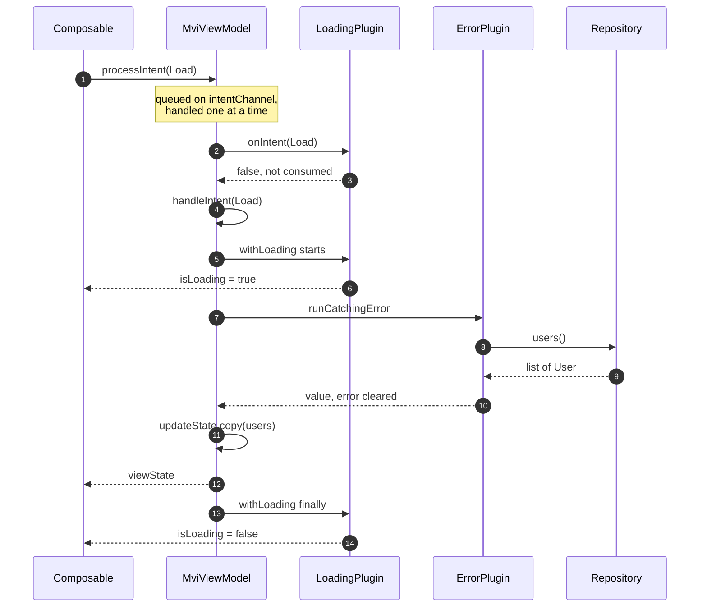
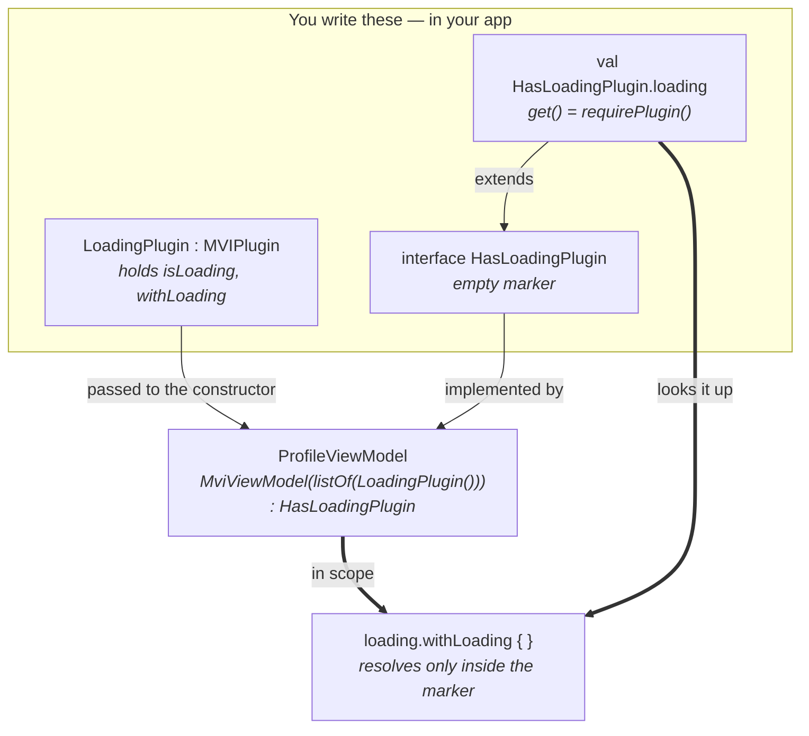
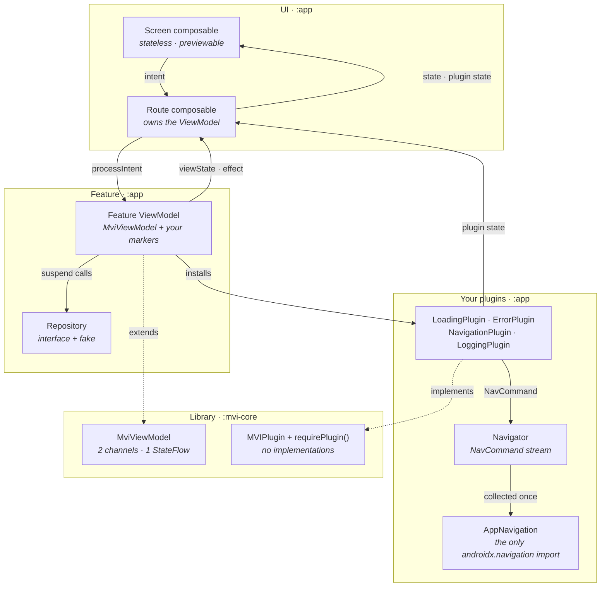
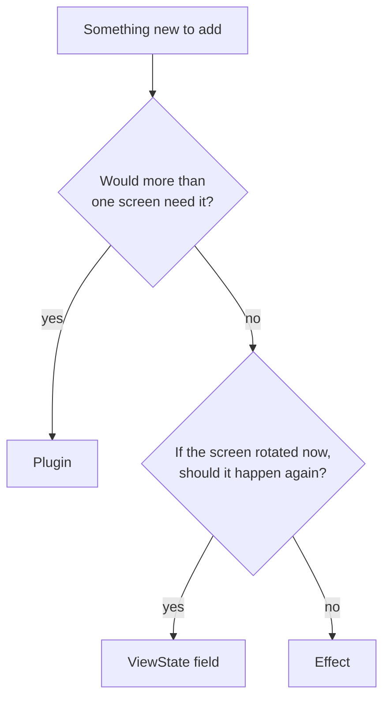

# MVI Blueprint

A small MVI base for Android Compose. One parent class owns the MVI loop, and everything
else is a **plugin** you write.

**The library ships zero plugins.** Loading, errors, navigation and analytics aren't
privileged concepts baked into a base class — they're four ordinary plugins the demo app
writes, in [app/…/plugins/](app/src/main/java/com/example/mvi/plugins). Yours sit
alongside them as equals, written exactly the same way.

`:mvi-core` is five files: the three marker types, the ViewModel, the plugin interface,
the plugin lookup, and a Compose helper.

```kotlin
class ProfileViewModel(
    private val repository: UserRepository,
    plugins: List<MVIPlugin>,
) : MviViewModel<ProfileViewState, ProfileIntent, NoEffect>(plugins),
    HasLoadingPlugin,      // <- your marker, gives you `loading`
    HasErrorPlugin {       // <- your marker, gives you `errors`

    override fun initialState() = ProfileViewState()

    override suspend fun handleIntent(intent: ProfileIntent) = when (intent) {
        ProfileIntent.Load, ProfileIntent.Retry -> loading.withLoading {
            val user = errors.runCatchingError { repository.user(id) } ?: return@withLoading
            updateState { copy(user = user) }
        }
    }
}
```

A complete screen: loading state, error handling, retry-ready, and no
`viewModelScope.launch` anywhere.

---

# Part 1 — How to use it

## Step 1. Add the module

```kotlin
dependencies {
    implementation(project(":mvi-core"))
}
```

## Step 2. Write the contract

One file per screen, three declarations.

```kotlin
sealed interface ProfileIntent : Intent {
    data object Load : ProfileIntent
    data object Retry : ProfileIntent
}

data class ProfileViewState(
    val user: User? = null,
    val isLoading: Boolean = false,
    val errorMessage: String? = null,
) : ViewState

sealed interface ProfileEffect : Effect {
    data class ShowMessage(val text: String) : ProfileEffect
}
```

No one-shot events at all? Use the shared `NoEffect` as your `Effect` type and skip the
third declaration.

> Steps 3 and 4 below build **the same screen twice** — first with no plugins, then with
> two. That's not repetition for its own sake: it's where `isLoading` and `errorMessage`
> disappear from the state above, and it's the clearest way to see what a plugin is
> actually for.

## Step 3. Write the ViewModel — version 1, no plugins

Extend `MviViewModel`, implement two functions. **Pass no plugins at all**; the argument
defaults to empty.

```kotlin
class ProfileViewModel(
    private val repository: UserRepository,
) : MviViewModel<ProfileViewState, ProfileIntent, ProfileEffect>() {

    override fun initialState() = ProfileViewState()

    override suspend fun handleIntent(intent: ProfileIntent) {
        when (intent) {
            ProfileIntent.Load, ProfileIntent.Retry -> {
                updateState { copy(isLoading = true, errorMessage = null) }
                try {
                    val user = repository.user(id)   // suspend call, no launch needed
                    updateState { copy(user = user) }
                } catch (e: IOException) {
                    updateState { copy(errorMessage = e.message) }
                } finally {
                    updateState { copy(isLoading = false) }
                }
            }
        }
    }
}
```

`handleIntent` is `suspend`, and intents are handled one at a time in order — so call
suspending code directly. No `launch`.

**This is a complete, working screen.** Plugins are entirely optional; if nothing here is
shared with another screen, stop at this step.

## Step 4. The same screen — version 2, with plugins

The moment a second screen needs that same try/catch/finally, it belongs in a plugin. The
demo app writes four. They aren't special — read them as examples and take, adapt or
ignore them.

| Plugin (in `:app`) | Marker | Accessor | What it does |
| --- | --- | --- | --- |
| [`LoadingPlugin`](app/src/main/java/com/example/mvi/plugins/LoadingPlugin.kt) | `HasLoadingPlugin` | `loading` | `withLoading { }`, `isLoading` |
| [`ErrorPlugin`](app/src/main/java/com/example/mvi/plugins/ErrorPlugin.kt) | `HasErrorPlugin` | `errors` | `runCatchingError { }`, `error` |
| [`NavigationPlugin`](app/src/main/java/com/example/mvi/plugins/NavigationPlugin.kt) | `HasNavigationPlugin` | `navigation` | `navigateTo(dest)`, `navigateBack()` |
| [`LoggingPlugin`](app/src/main/java/com/example/mvi/plugins/LoggingPlugin.kt) | `HasLoggingPlugin` | `logging` | `logButtonEvent("id")` |

Install by passing instances, and declare the matching markers. Here is Step 3's screen
again, unchanged except where the plugins take over:

```kotlin
// Two fields leave the state — the plugins hold them now.
data class ProfileViewState(val user: User? = null) : ViewState

class ProfileViewModel(
    private val repository: UserRepository,
    plugins: List<MVIPlugin>,
) : MviViewModel<ProfileViewState, ProfileIntent, ProfileEffect>(plugins),
    HasLoadingPlugin,      // <- puts `loading` in scope
    HasErrorPlugin {       // <- puts `errors` in scope

    override fun initialState() = ProfileViewState()

    override suspend fun handleIntent(intent: ProfileIntent) {
        when (intent) {
            // The whole try/catch/finally above collapses into this.
            ProfileIntent.Load, ProfileIntent.Retry -> loading.withLoading {
                val user = errors.runCatchingError { repository.user(id) } ?: return@withLoading
                updateState { copy(user = user) }
            }
        }
    }
}

// at the factory
ProfileViewModel(repository, plugins = listOf(LoadingPlugin(), ErrorPlugin()))
```

What changed, and nothing else did:

- `isLoading` and `errorMessage` left `ProfileViewState` — no screen declares them again
- the try/catch/finally became `withLoading` + `runCatchingError`
- two markers appeared, which is what puts `loading` and `errors` in scope

`navigation` is **not** in scope here — no `HasNavigationPlugin`. Leave a marker off and
that accessor doesn't exist for your class: a compile error, not a null.
`standardPlugins("screen_id")` in
[PluginMarkers.kt](app/src/main/java/com/example/mvi/plugins/PluginMarkers.kt) bundles all
four for screens that want the lot.

**Writing your own plugin is Step 4 done from scratch — see [Adding a plugin](#adding-a-plugin).**

## Step 5. Write the screen

Two composables. The **Route** owns the ViewModel; the **Screen** is a pure function you
can `@Preview`.

```kotlin
@Composable
fun ProfileRoute(viewModel: ProfileViewModel = viewModel(factory = ...)) {
    val state by viewModel.viewState.collectAsStateWithLifecycle()
    val isLoading by viewModel.loading.isLoading.collectAsStateWithLifecycle()
    val error by viewModel.errors.error.collectAsStateWithLifecycle()

    CollectEffects(viewModel.effect) { effect ->
        when (effect) {
            is ProfileEffect.ShowMessage -> snackbarHostState.showSnackbar(effect.text)
        }
    }

    LaunchedEffect(Unit) { viewModel.processIntent(ProfileIntent.Load) }

    ProfileScreen(state, isLoading, error, viewModel::processIntent)
}
```

You collect **one stream per source of truth**: your own `viewState`, plus anything the
plugins hold. That's the visible cost of not putting loading and errors in `ViewState`.

## Step 6. Wire navigation once, for the whole app

The demo's `NavigationPlugin` turns calls into `NavCommand`s on an app-wide `Navigator`.
One collector applies them, so features never touch a `NavController`:

```kotlin
CollectNavigation(ServiceLocator.navigator) { command ->
    when (command) {
        is NavCommand.To -> navController.navigate(command.destination.route)
        is NavCommand.Back -> navController.popBackStack()
        is NavCommand.PopUpTo -> navController.popBackStack(command.route, command.inclusive)
    }
}
```

## Step 7. Test it

Send intents. Assert screen data on `viewState`, and anything else on the plugins. No
Robolectric, no mocking library.

```kotlin
@Test
fun `a failure lands in the error plugin`() = runTest {
    val viewModel = ProfileViewModel(FailingRepository(), listOf(LoadingPlugin(), ErrorPlugin()))

    viewModel.processIntent(ProfileIntent.Load)
    advanceUntilIdle()

    assertEquals("offline", viewModel.errors.error.value?.message)
    assertFalse(viewModel.loading.isLoading.value)
}
```

`MainDispatcherRule` is needed because `viewModelScope` runs on `Dispatchers.Main`.

**Working examples:** [UserListViewModel](app/src/main/java/com/example/mvi/feature/userlist/UserListViewModel.kt)
(all four plugins) and [UserDetailViewModel](app/src/main/java/com/example/mvi/feature/userdetail/UserDetailViewModel.kt)
(three — `logging` genuinely won't compile there).

---

# Part 2 — How it works

## Step 1. The UI sends an intent

`processIntent(intent)` drops it on a `Channel(UNLIMITED)` and returns immediately. It
never suspends and never drops anything, so it's safe from any callback or first
composition.

## Step 2. The channel serializes it

A single collector, started in the base class's `init`, drains the channel **one intent at
a time, in order**. This is why `handleIntent` can be `suspend`: while it awaits the
network, the next intent just waits its turn. No races, no `launch` in features.

## Step 3. Plugins get first look

```kotlin
val handled = plugins.map { it.onIntent(intent) }.any { it }
if (!handled) handleIntent(intent)
```

Every plugin sees every intent. Any plugin returning `true` **consumes** it, and your
`handleIntent` never runs. (Mapped before reduced deliberately — `any` short-circuits, so
otherwise a plugin's visibility would depend on its position in the list.)

## Step 4. `handleIntent` runs

Your `when` branch executes. It reduces state, emits effects, calls plugins, and awaits
the repository — all inline.

## Step 5. State goes out

`updateState { copy(...) }` reduces atomically via `getAndUpdate`, then broadcasts
`onStateChanged(old, new)` to every plugin. The UI collects `viewState`.

## Step 6. Effects go out

`emitEffect(e)` queues on a second `Channel` and broadcasts `onEffectEmitted`. Buffered,
delivered to exactly one collector, never replayed on rotation.

## The whole path, in one picture



## How a plugin becomes reachable

The library gives you `requirePlugin()`. The marker and accessor are three lines you write
once per plugin, and they're what turn a list entry into a typed, compile-time-scoped
property.



Because the accessor extends the marker, `loading` only resolves inside a class that
declared `HasLoadingPlugin`. That's the compile-time scoping — a screen that never asked
for loading cannot name it.

Plugins are set up in the base `init`, so they're usable from your own `init` too. Each
gets `onCreate(viewModel, scope)`; anything else it needs comes from its own constructor.

## Where everything lives



```
:mvi-core          five files, no plugins
  MviMarkers.kt      ViewState · Intent · Effect · NoEffect
  MviViewModel.kt    the loop
  plugins/           MVIPlugin · requirePlugin / pluginOrNull
  compose/           CollectEffects

:app
  plugins/           the four example plugins, their markers and accessors
  platform/          DispatcherProvider
  data/ · di/ · feature/ · navigation/
```

---

## Gotchas

- **`updateState`'s reducer must be pure.** `getAndUpdate` can run it twice under
  contention — never send an effect or start work inside it.
- **`handleIntent` blocks the queue while it suspends.** That's the design, but don't put
  a 30-second poll in it.
- **A consuming plugin can't change screen state.** `updateState` belongs to the
  ViewModel, so `onIntent` returning `true` suits guards and interception, not reducers.
- **A marker and its plugin can disagree.** The compiler stops you using an accessor
  without its marker, but nothing checks the plugins list — that mismatch throws from
  `requirePlugin()` naming the missing type.

**State, effect, or plugin?**



## Adding a plugin

Four steps, all in your own code. This is the same path the demo's four plugins took —
there's no privileged built-in set to imitate.

### Step 1. Write the plugin

Implement `MVIPlugin` and override only the hooks you need. All five have defaults, and
dependencies go in your constructor.

| Hook | When it runs | Use it for |
| --- | --- | --- |
| `onCreate(viewModel, scope)` | Once, during ViewModel construction | Capture the scope for background work |
| `onIntent(intent): Boolean` | Before `handleIntent`, for every intent | Observe — or return `true` to **consume** |
| `onStateChanged(old, new)` | After every `updateState` | React to state without the screen knowing |
| `onEffectEmitted(effect)` | After every `emitEffect` | Audit or mirror effects |
| `onCleared()` | With the ViewModel | Release anything you held |

```kotlin
class UndoPlugin : MVIPlugin {
    val history = mutableListOf<String>()

    override fun onStateChanged(oldState: ViewState, newState: ViewState) {
        if (oldState is EditViewState && newState is EditViewState && oldState.text != newState.text) {
            history += oldState.text
        }
    }

    fun previous(): String = history.removeLastOrNull() ?: ""
}
```

### Step 2. Add a marker interface

```kotlin
interface HasUndoPlugin
```

### Step 3. Add an accessor

```kotlin
val HasUndoPlugin.undo: UndoPlugin
    get() = (this as MviViewModel<*, *, *>).requirePlugin()
```

Use `pluginOrNull<UndoPlugin>()` instead if the plugin is genuinely optional.

### Step 4. Install it

Pass the instance and implement the marker.

```kotlin
class EditorViewModel(
    undoPlugin: UndoPlugin = UndoPlugin(),   // a constructor param, so it can be passed below
) : MviViewModel<EditViewState, EditIntent, NoEffect>(listOf(undoPlugin)),
    HasUndoPlugin {

    override suspend fun handleIntent(intent: EditIntent) = when (intent) {
        EditIntent.Undo -> updateState { copy(text = undo.previous()) }  // <- your accessor
        // ...
    }
}
```

A full worked example is in
[CustomPluginTest.kt](app/src/test/java/com/example/mvi/CustomPluginTest.kt).

## Running it

```bash
./gradlew :app:installDebug
```

24 fake users, no network. Flip **Simulate failure** and reload to exercise `ErrorPlugin`
and retry. Tap a row for `NavigationPlugin`. Watch Logcat's `Analytics` tag for
`LoggingPlugin`.

```bash
./gradlew test
```

33 JVM unit tests, no emulator: 17 for the base and the plugin mechanism, 6 for the
example plugins, 6 for a full screen, 4 for writing a plugin from scratch.

## Not included

No DI framework (a small `ServiceLocator`), no networking (in-memory fake), and no plugins
in the library itself — that last one on purpose.
