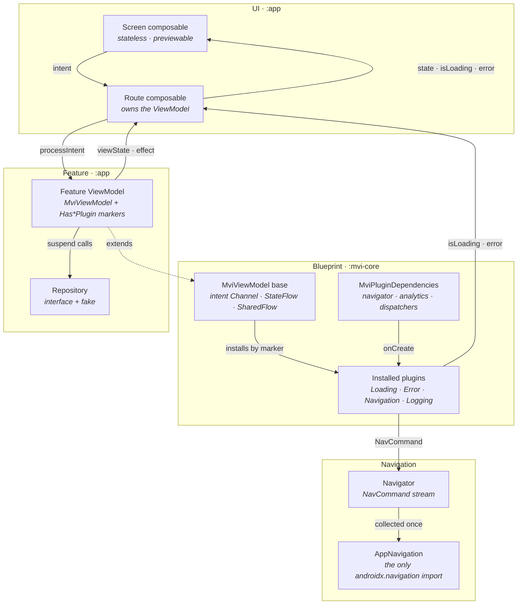
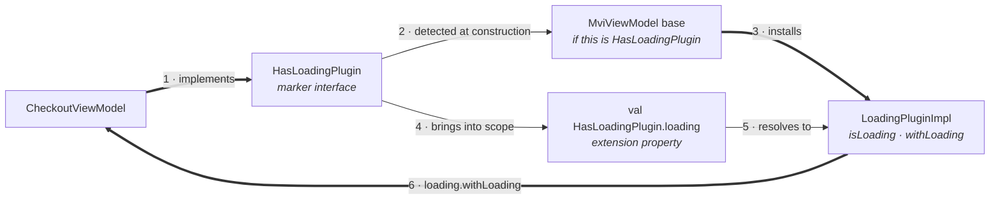
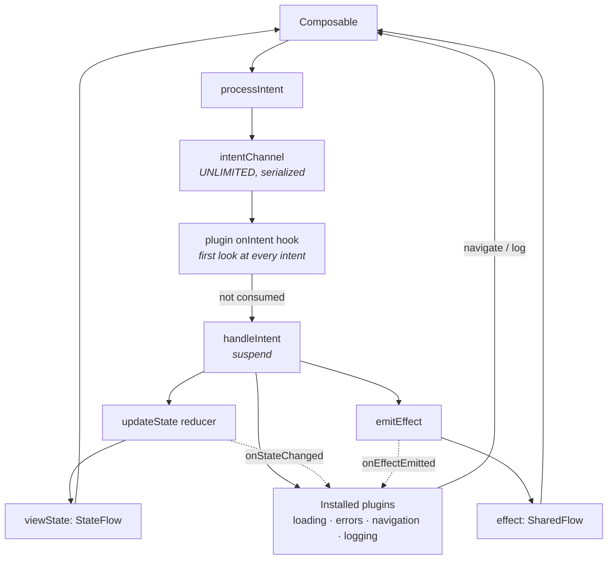
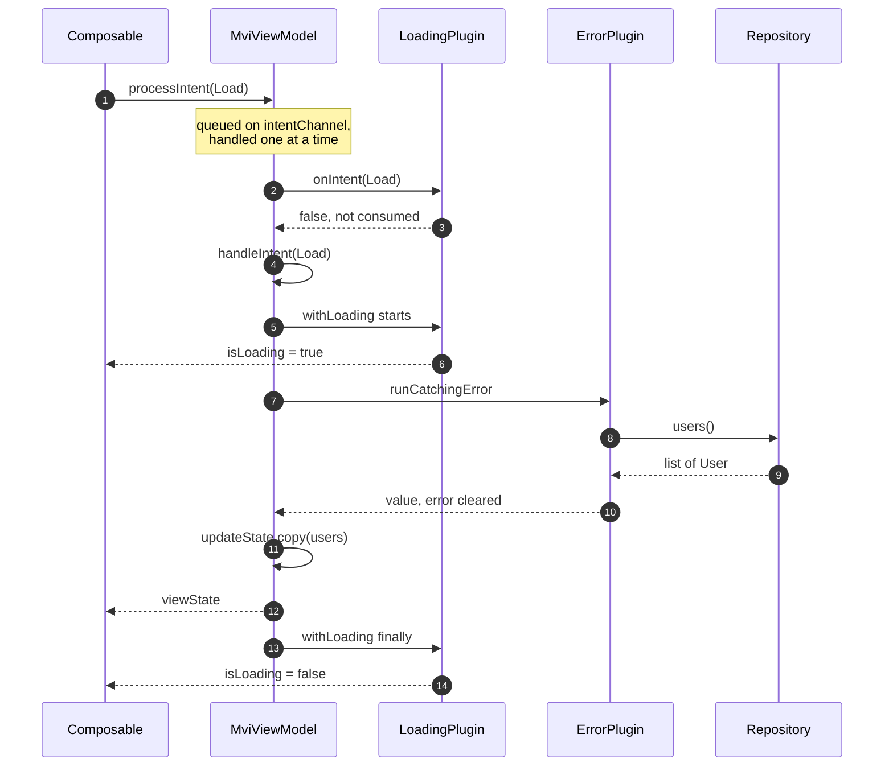
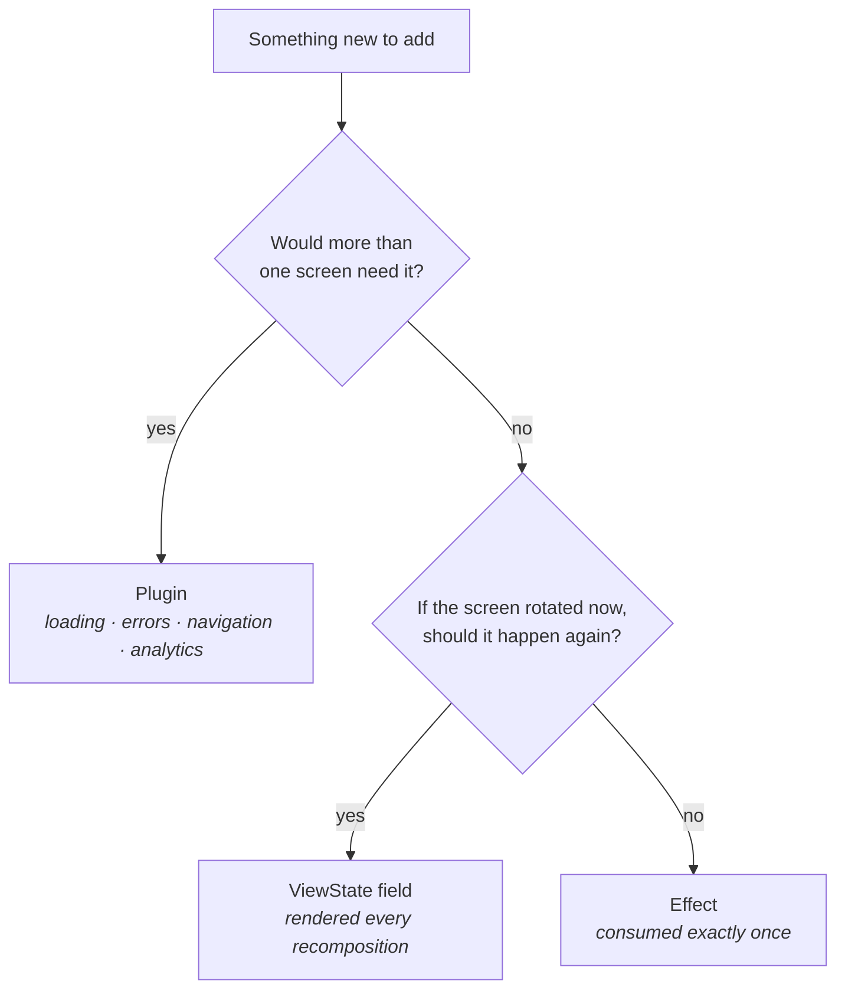

# MVI Blueprint — base ViewModel + plugin delegation

A small, complete, runnable reference for building Android screens with MVI, organised
around one idea:

> **The parent class owns the MVI loop. Cross-cutting concerns are delegated to plugins
> that install themselves based on the interfaces a screen implements.**

Most "base ViewModel" designs end up with a class that has grown a loading flag, an error
holder, a navigation helper and an analytics hook — and every screen inherits all of it
whether it needs it or not. This project shows the alternative: the base keeps the loop it
genuinely owns, and every other capability is an `MVIPlugin` that a screen opts into by
implementing a marker interface.

Nothing here is magic and nothing is a framework you have to buy into. The core is ~450
lines of ordinary Kotlin you are meant to read, disagree with, and adapt.

---

## Architecture at a glance



The two rules the diagram encodes: a feature ViewModel talks to its repository and to its
installed plugins, and to nothing else. Navigation leaves through the plugin as a value,
so no ViewModel ever holds a `NavHostController`.

---

## The base owns the loop

`MviViewModel<T : ViewState, I : Intent, E : Effect>` holds the intent channel, the state
flow, the effect flow, and the reducer — directly, with no indirection to chase:

```kotlin
abstract class MviViewModel<T : ViewState, I : Intent, E : Effect>(
    protected val dispatcherProvider: DispatcherProvider,
    private val pluginDependencies: MviPluginDependencies,
) : ViewModel() {

    private val intentChannel = Channel<I>(Channel.UNLIMITED)
    val viewState: StateFlow<T>
    val effect: SharedFlow<E>

    abstract fun initialState(): T
    abstract suspend fun handleIntent(intent: I)

    fun processIntent(intent: I)
    protected fun updateState(reducer: T.() -> T)
    protected fun emitEffect(effect: E)
}
```

Intents are serialized through the channel, one at a time, in order. **`handleIntent` is
`suspend`**, so async work is awaited directly — no `viewModelScope.launch` in any feature.

## Plugins are the delegation

A plugin is a self-contained capability that observes the loop through five hooks:

```kotlin
interface MVIPlugin {
    fun onCreate(viewModel: ViewModel, viewModelScope: CoroutineScope, dependencies: MviPluginDependencies) {}
    fun onIntent(intent: Intent): Boolean = false      // return true to consume the intent
    fun onStateChanged(oldState: ViewState, newState: ViewState) {}
    fun onEffectEmitted(effect: Effect) {}
    fun onCleared() {}
}
```

Installation is by **marker interface**, checked in the base class:

```kotlin
internal val _loadingPlugin = if (this is HasLoadingPlugin) LoadingPluginImpl() else null
```

and reached through an **extension property on that same marker**:

```kotlin
val HasLoadingPlugin.loading: LoadingPluginImpl
    get() = (this as MviViewModel<*, *, *>)._loadingPlugin ?: error("...")
```

Those two halves — the install check and the accessor — hang off the same marker:



Declaring the marker is the only step you write. Steps 2 to 5 are the mechanism, and step
6 is what you get back.

That pairing is the part worth copying. A screen writes one word on its class declaration:

```kotlin
class CheckoutViewModel(...) : MviViewModel<...>(...),
    HasLoadingPlugin,
    HasErrorPlugin {

    override suspend fun handleIntent(intent: CheckoutIntent) {
        loading.withLoading {                                   // in scope, because of the marker
            val cart = errors.runCatchingError { repo.cart() } ?: return@withLoading
            updateState { copy(items = cart.items) }
        }
    }
}
```

Nothing is constructed, registered, or passed in. And a screen that *didn't* declare
`HasLoadingPlugin` cannot write `loading` at all — it's a compile error, not a null. You
get the ergonomics of a method on the base class with none of the cost.

**The consequence worth internalising:** `isLoading` and `error` are not fields on any
screen's `ViewState`. They live on the plugins. No feature declares them again, and no
feature can forget to clear them.

---

## The loop



Plugins get **first look** at every intent. Any plugin returning `true` from `onIntent`
consumes it, and the feature's `handleIntent` never sees it.

### One intent, end to end

A `Load` on the sample's list screen, showing exactly who touches what:



The screen collects three streams — `viewState`, `loading.isLoading`, `errors.error` — and
only the first belongs to the feature. Swap the repository call for one that throws and
nothing above changes shape: `runCatchingError` returns null, `withLoading`'s `finally`
still clears the spinner, and the error surfaces on `errors.error`.

---

## Modules

```
:mvi-core          The blueprint. No DI framework, no networking, no app code.
  core/            ViewState · Intent · Effect · NoEffect · MviViewModel
  core/plugins/    MVIPlugin · markers · accessors · MviPluginDependencies
                   LoadingPluginImpl · ErrorPluginImpl · NavigationPluginImpl · LoggingPluginImpl
  core/navigation/ Navigator, Destination, NavCommand + CollectNavigation
  core/analytics/  AnalyticsLogger, AnalyticsEvent
  core/error/      OperationError
  core/helpers/    DispatcherProvider
  core/compose/    CollectEffects

:app               A sample that consumes it.
  data/            UserRepository interface + an in-memory fake
  di/              A small ServiceLocator (swap for Hilt without touching :mvi-core)
  feature/userlist/    Opts into all four plugins
  feature/userdetail/  Opts into three — no logging, and `logging` won't compile there
  navigation/      The only file that imports androidx.navigation
```

---

## Adding a screen — the four steps

**1. Write the contract.** Three declarations in one file. Leave loading and errors out —
the plugins own those.

```kotlin
sealed interface CartIntent : Intent {
    data object Load : CartIntent
    data class QuantityChanged(val itemId: String, val quantity: Int) : CartIntent
}

data class CartViewState(val items: List<CartRow> = emptyList()) : ViewState

sealed interface CartEffect : Effect {
    data class ShowMessage(val text: String) : CartEffect
}
// No one-shot events at all? Use the shared `NoEffect` as your Effect type.
```

**2. Declare the ViewModel and the plugins it wants.**

```kotlin
class CartViewModel(
    private val repository: CartRepository,
    dispatcherProvider: DispatcherProvider,
    pluginDependencies: MviPluginDependencies,
) : MviViewModel<CartViewState, CartIntent, CartEffect>(dispatcherProvider, pluginDependencies),
    HasLoadingPlugin,
    HasErrorPlugin,
    HasNavigationPlugin {

    override fun initialState() = CartViewState()

    override suspend fun handleIntent(intent: CartIntent) = when (intent) {
        CartIntent.Load -> loading.withLoading {
            val cart = errors.runCatchingError { repository.cart() } ?: return@withLoading
            updateState { copy(items = cart.rows) }
        }
        is CartIntent.QuantityChanged -> updateState { /* ... */ }
    }
}
```

**3. Split the UI in two.** A stateful `Route` that owns the ViewModel and collects the
three streams, and a stateless `Screen` that is a pure function of them.

```kotlin
@Composable
fun CartRoute(viewModel: CartViewModel = viewModel(factory = ...)) {
    val state by viewModel.viewState.collectAsStateWithLifecycle()
    val isLoading by viewModel.loading.isLoading.collectAsStateWithLifecycle()
    val error by viewModel.errors.error.collectAsStateWithLifecycle()

    CollectEffects(viewModel.effect) { effect -> /* snackbars, not navigation */ }

    CartScreen(state, isLoading, error, viewModel::processIntent)
}
```

**4. Test through the contract.** Assert screen data on `viewState`, and loading/errors on
the plugins.

```kotlin
@Test
fun `a failure lands in the error plugin`() = runTest {
    val viewModel = CartViewModel(FailingRepository(), dispatchers, dependencies)
    viewModel.viewState.value                       // lazy init: start the collector
    viewModel.processIntent(CartIntent.Load)
    advanceUntilIdle()

    assertEquals("offline", viewModel.errors.error.value?.message)
    assertFalse(viewModel.loading.isLoading.value)
}
```

---

## Adding a plugin

When two screens need the same cross-cutting behaviour, that is the signal.

1. Implement `MVIPlugin`, overriding only the hooks you need.
2. Add a `HasXxxPlugin` marker in `PluginMarkers.kt`.
3. Add the accessor in `PluginAccessors.kt`.
4. Add the install line and the `plugins` list entry in `MviViewModel`.

**Step 4 is the one closed part of the design, and it's worth knowing about**: the plugin
set is hardcoded in the base class, so a new plugin means editing `MviViewModel` — and a
feature module can't define its own. That is the deliberate trade for auto-installation
with zero per-screen wiring and compile-time safety. If you later want open registration,
the change is to build `plugins` from a list supplied through `MviPluginDependencies`,
at the cost of the `this is HasXxxPlugin` check and the non-null accessors.

---

## The rules worth arguing about

**State, effect, or plugin?** Navigation in particular is a plugin here, not an effect.



**Intents are named after what happened, not what to do.** `UserClicked`, not `OpenUser`.
The UI reports; the ViewModel decides.

**`handleIntent` may suspend, and should.** Intents are serialized through an UNLIMITED
channel, so awaiting the network is correct and the next intent simply queues. This is the
opposite of the usual "fire and forget" advice, and it's what removes `launch` from every
feature.

**Prefer `withLoading` and `runCatchingError` over manual flags.** The `finally` in
`withLoading` is why a spinner never sticks after a thrown exception.

**Nothing spins up until the screen is observed.** `viewState` is `by lazy`, and plugin
`onCreate` plus the intent collector both start on first access. Intents sent before then
are parked safely in the channel — but calling `navigation.navigateTo(...)` from `init`
throws, because the plugin has no `Navigator` yet. Navigate from an intent, not from `init`.

**Effects have no replay and no buffer.** `emitEffect` suspends until a collector is
active, so an effect emitted while the screen is stopped is delivered when it returns —
but ordering across several such effects isn't guaranteed. Keep effects few.

---

## Running it

```bash
./gradlew :app:installDebug
```

The sample lists 24 fake users. Flip **Simulate failure** and reload to exercise
`ErrorPlugin` and the retry path — the failure is deterministic, so you can demo it on
purpose. Tap a row to see `NavigationPlugin` drive the NavHost, and watch Logcat's
`Analytics` tag for `LoggingPlugin` output.

```bash
./gradlew test
```

24 unit tests, all JVM, no emulator: 11 for the base class, 7 for the plugins standalone,
6 for a full screen.

---

## What is deliberately not here

- **A DI framework.** In production `MviPluginDependencies` is `@Inject`-constructed and
  field-injected into the base. The blueprint passes it as a constructor parameter — the
  only intentional difference from the production shape.
- **Networking.** `FakeUserRepository` is in memory, so the project runs with no keys.
- **Pagination, search, and other per-screen behaviours.** They aren't cross-cutting, so
  they don't belong in a plugin; they belong in a feature's own ViewModel or its data layer.
- **`SavedStateHandle` restoration.** Would be a good fifth plugin.

If adding a capability requires changing `handleIntent` in a dozen features, it should
have been a plugin.
